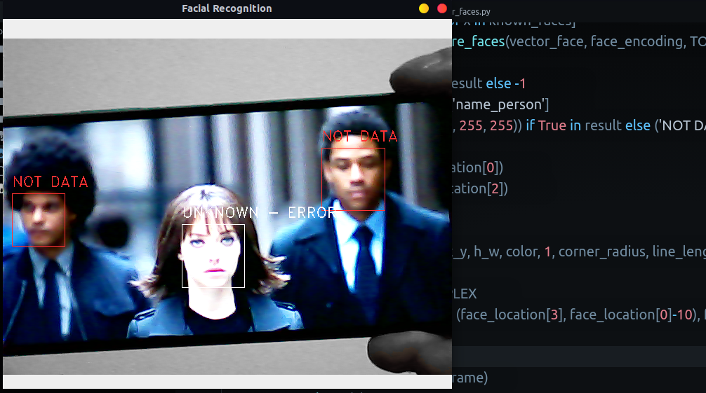

# Face Recognition
This project was designed as a base to the facial recognition of several people in real time, the algorithm distinguishes and identifies by name the people who were previously added with their name and face, in turn those who are not in the records are identified as 'NOT DATA' in red .

## Requirements
The requirements are

```bash
sudo apt install -y python3-pip
sudo apt install -y python3-venv
```
In addition to this, it is important to install ***Dlib

​		***[Dlib MacOS and Ubuntu](https://gist.github.com/smitshilu/7b21016c496e412a966a34045a8c21ff)***

​		***[Dlib Windows-10](https://pythonmana.com/2022/142/202205220835226051.html)***

## Config

Once the prerequisites are installed, we will continue with the main requirements where the first step is to create our virtual environment in the path indicated by the image, to create our environment the command is executed; ```python3 -m venv venv```***(this corresponds to the name you want to give your environment).***

The next step is to activate the virtual environment

```bash
source venv/bin/activate
```

once your environment is active, we will install all the requirements using the ***[requirements.txt](requirements.txt)*** file with the following command.

```bash
pip3 install -r requirements.txt
```

## ***This program is inspired by the movie Anon(2018)***


## Quick Start

Before starting our program, we must add the photographs of the people we want to be recognized in the folder ***[face_pic](face_pic)***, for practical purposes we will leave a photo of the protagonist of the film and the name of the image will be the name that we want to appear when it is recognized on camera.

 the way to start the program would be with the command

```bash
python3 face_recog.py
```

The following image shows us the image which would be the result of our facial recognition.




## License

This program is free software; you can redistribute it and/or modify it under the terms of the GNU General Public License as published by the Free Software Foundation; either version 3 of the License, or any later version.

This program is distributed in the hope that it will be useful, but WITHOUT ANY WARRANTY; without even the implied warranty of MERCHANTABILITY or FITNESS FOR A PARTICULAR PURPOSE. See the GNU General Public License for more details.

You should have received a copy of the GNU General Public License along with this program; if not, write to the Free Software Foundation, Inc., 59 Temple Place, Suite 330, Boston, MA 02111-1307 USA

See './LICENSE' for more information.
